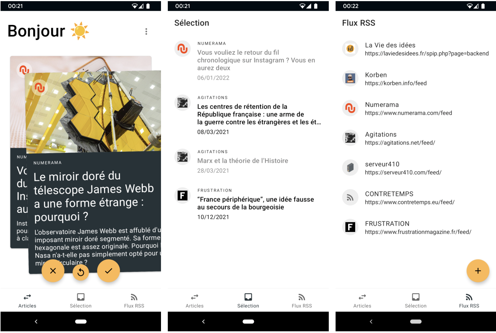

# Fox RSS

Fox RSS is a simple rss reader which allow you to create a selection of articles to read later. The application is available [on the Play Store](https://play.google.com/store/apps/details?id=com.pigeoff.rss) in english and french.

Fox RSS is a free and open source android application.

## How to use it

### Add rss feeds

There are two ways to add a rss feed. The first one is to manually add the url of the rss feed. Go in the tab « RSS Feeds » and click  on the "+" button. Add the url there. The second way is to share a website from you favorite web browser. When sharing it, choose Fox RSS as destination app. Fox RSS will recognize automatically the rss feed if it exists.

### Do your selection

In the first tab, drag the articles you want to the right and the ones you don't want to the left. By doing so, you're makng your selection of articles to read later. All of them are available in the tab « Selection ». Unread articles will stay there indefinitely, whereas read articles will vanish after a specific time chosen in the settings (or one week by default).

When you click on an article (in the swipe view or the selection view), a reader will open to let you read it. You can also open the article in your web browser from the reader view.

### See all the articles of a rss feed

If you want, you can have access to all the articles of a specific rss feed by clicking on it in the « RSS Feeds » tab.

## Bibliotèques de codes utilisées

* [Google Material Components](https://github.com/material-components/material-components-android)
* [JSoup](https://github.com/jhy/jsoup/)
* [Picasso](https://github.com/square/picasso)
* [Licences Dialog](https://github.com/PSDev/LicensesDialog)
* [Readability4J](https://github.com/dankito/Readability4J)
